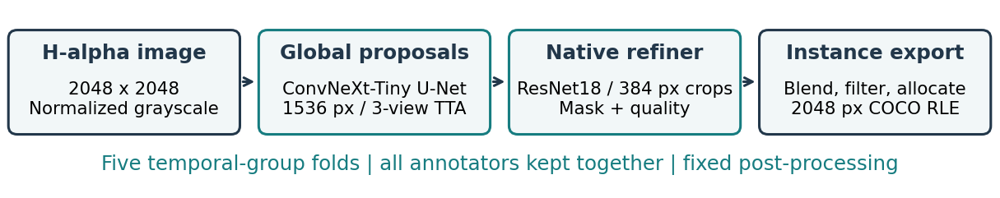

# Anon Tokyo · Solar Filament Segmentation 2026

**Global context, native detail, and auditable validation.** A two-stage solution to the [Solar Filament Segmentation Challenge 2026](https://www.kaggle.com/competitions/filament-segmentation-2026): ConvNeXt U-Net proposals followed by instance-conditioned refinement at native resolution.

Team: **Anon Tokyo** · Contact: **pufanzhang1@gmail.com**

[Technical report](report/AnonTokyo_Report.pdf) · [Complete notebook](pipeline.ipynb) · [Release identity](artifacts/release.json) · [Model weights](https://www.kaggle.com/datasets/zpf999/anon-tokyo-solar-filament-2026-checkpoints) · [Reproduction guide](REPRODUCIBILITY.md)



## Evidence at a glance

| Evaluation | PQ | Scope |
|---|---:|---|
| Coarse proposals | 0.4287 | Pooled predictions on five held-out folds |
| Frozen refinement recipe | **0.4427** | Same folds; each image excluded from its predicting models |
| Confirmation folds 1–4 | **0.4430** | Paired gain +0.0149; temporal-group bootstrap 95% CI [0.0118, 0.0182] |
| Public leaderboard | **0.38** | Verified submitted predictions; see release identity for the chosen submission |

The OOF score estimates the single-fold recipe. It is **not** an OOF estimate of the test ensemble or an all-data model, and it is not a forecast of the private score. The complete report includes unsuccessful experiments, confidence intervals, annotation disagreement, split/merge diagnostics, and small-instance failure cases.

The released deployment averages five ConvNeXt-Tiny models (weight 0.1 each) and two ConvNeXt-V2-Base models (weight 0.25 each), then five equally weighted native refiners. A separately trained all-data Tiny/refiner pair also scored 0.38 and is retained as a documented alternative; it has no held-out validation score.

## Reproduce the submitted predictions

Use Python 3.12 and an NVIDIA GPU. The tested runtime is PyTorch 2.8.0, CUDA 12.8, and RTX 5090 (32 GB).

```bash
git clone https://github.com/zhang0894/Solar-Filament-Segmentation-Challenge-2026-by-Anon-Tokyo.git
cd Solar-Filament-Segmentation-Challenge-2026-by-Anon-Tokyo
python3.12 -m venv .venv
source .venv/bin/activate
python -m pip install -r requirements.txt
```

Accept the competition rules and download/extract the official data using your own Kaggle account. Then supply the directory containing `train/` and `test/`:

```bash
python -m scripts.reproduce \
  --data-dir /absolute/path/to/MAGFiLO_1.0_Kaggle_2026 \
  --download-checkpoints \
  --output reproduced_submission
```

The command verifies the frozen data manifest and every test image's checksum, downloads public weights, checks their SHA256 hashes, runs the released pipeline, decodes and audits every submitted mask, and writes `reproduced_submission/final/submission.csv`. It also compares the CSV hash with the released prediction file. No private checkpoint or prediction cache is required. GPU/library differences can change threshold-edge pixels; the audit must still pass.

Open [pipeline.ipynb](pipeline.ipynb) for the full path from official data and fold preparation through training, inference, validation, and report figures. Its evidence cells are already executed; expensive training and inference are explicitly opt-in.

## Repository map

| Path | Purpose |
|---|---|
| `filament/` | Data handling, models, losses, instance extraction, evaluation |
| `scripts/` | Training, inference, auditing, calibration, and reproducible packaging |
| `configs/` | Frozen pipelines and historical experiment plans |
| `artifacts/release.json` | Exact final pipeline, CSV checksum, submission reference and score |
| `artifacts/checkpoints.json` | Public weight locations and checksums |
| `artifacts/experiments/` | Saved run configurations and epoch histories |
| `artifacts/submission.csv` | Our released test prediction file |
| `report/` | PDF, official-template LaTeX source, figures and numerical evidence |
| `tests/` | Meaningful checks for grouping, RLE, provenance, evaluation and pipeline behavior |

After official data preparation, run `python -m scripts.build_fast_cache --size 1024 --pack-targets`, then `python -m pytest -q` to check the implementation. Some integration tests deliberately use the actual manifest and cached mask targets. Historical queue plans are experiment records; use the release configuration for final inference.

## Attribution and scope

Task supervision uses the official training masks. Encoders use generic ImageNet pretraining. The original competition images and annotation dataset are not redistributed here; obtain them from the organizer. See [NOTICE.md](NOTICE.md) for upstream model, evaluation, template, and GONG acknowledgments, and [MODEL_CARD.md](MODEL_CARD.md) for limitations. Code is released under the [MIT License](LICENSE).
